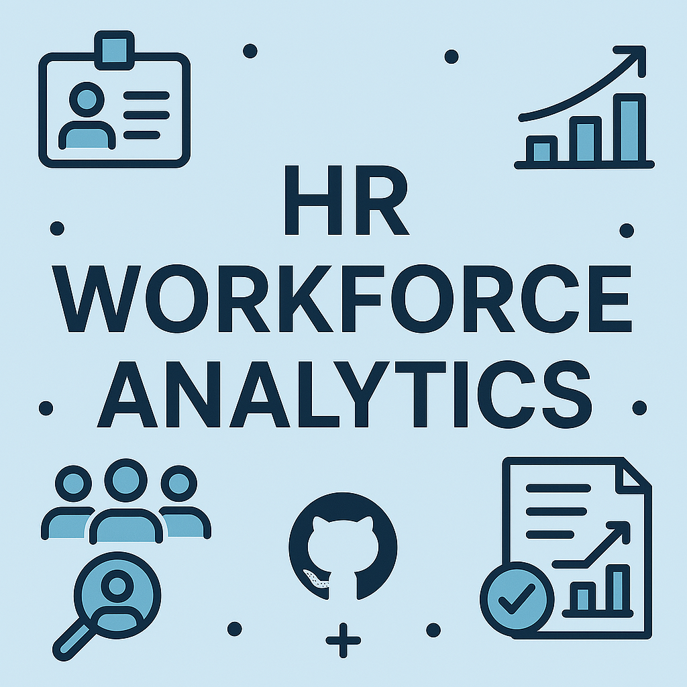
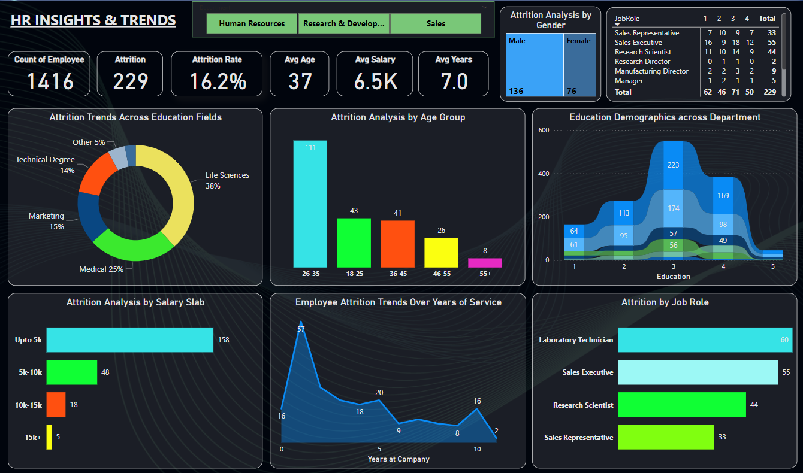
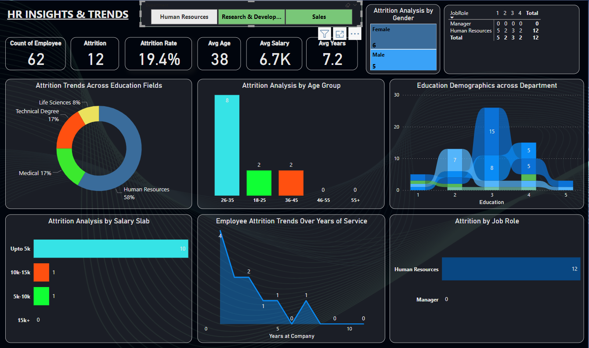
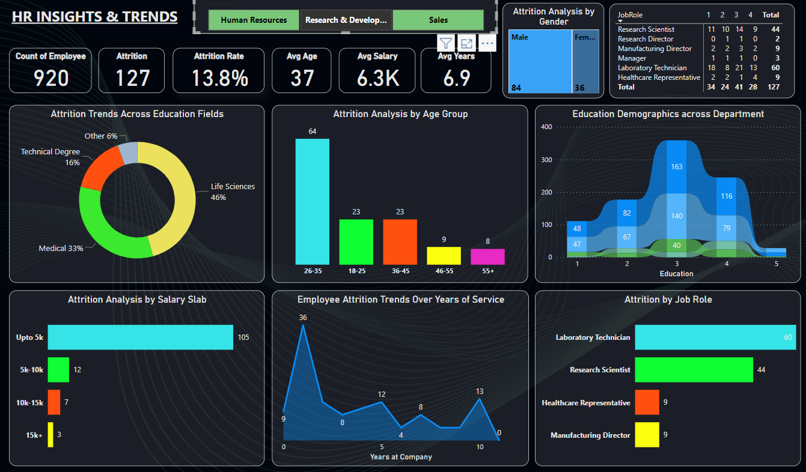
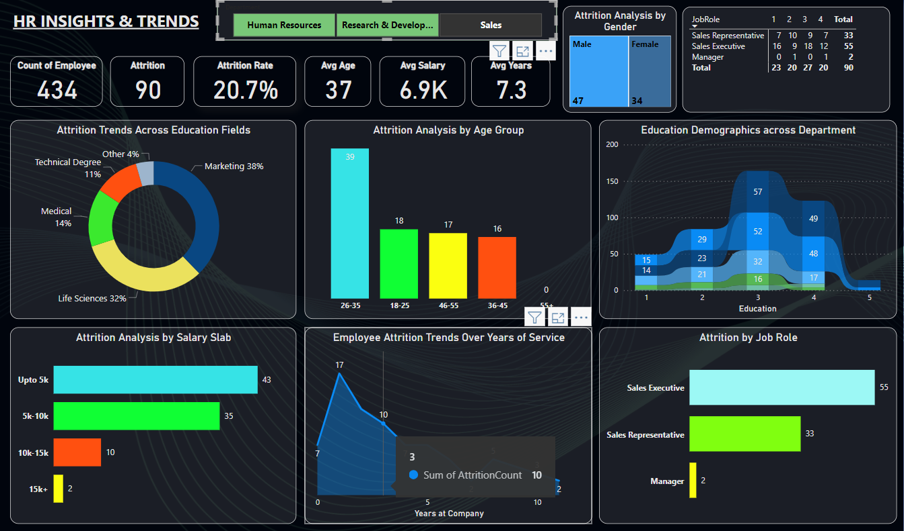

# 📊 HR Workforce Analytics Project

 **"An insightful dashboard analyzing HR workforce patterns and employee behavior."**

 **HR Workforce Analytics** is an interactive analytics project built using **Power BI** and real-world HR data. The dashboard and accompanying reports offer clear visualizations of key insights in employee trends, departmental performance, and workforce demographics. It's designed for HR professionals, analysts, and business leaders to quickly grasp complex workforce data.

 ---

 ## 🌐 View Live Project

 👉 [View Dashboard](https://lookerstudio.google.com/reporting/23acea98-5f36-49f9-a1a8-7803f756234e)
 ---

 ## 🖼️ Cover Page

 

 ---

 ## ✨ Features

 - **📊 Visual Storytelling:** Understand trends in employee demographics, performance, and satisfaction.
 - **📌 Detailed Dashboards:** Summary, overview, and deep-dive views powered by Power BI.
 - **📈 Departmental Insights:** Analyze performance and trends across various departments.
 - **🌍 Demographic Breakdown:** Visualize insights by age groups, gender, education, and job roles.
 - **📤 Exportable Reports:** Includes PDF and HTML formats for presentations and sharing.
 - **💡 Actionable Insights:** Designed to help stakeholders make informed HR decisions and improve workforce management.

## 📁 Project Structure

```
│   README.md
│
├───assets
│       Age Groups.png
│       background-bluee.jpg
│       cover_image.png
│       dashboard.png
│       Education.png
│       favicon.png
│       Gender.png
│       Job Role.png
│       preview.png
│       R&D.png
│       Salary Slab.png
│       sales.png
│       Years.png
│
├───data
│       HR_Analytics.csv
│
├───powerBI
│       hranalytics_insights_dashboard.pbix
│
└───report
        analytical_dashboard.pdf
        hrnalytics_comprehensive_report.pdf
        index.html
```


## 🧪 Setup & Usage

1. **Open Power BI File:**

   Open `powerBI/hranalytics_insights_dashboard.pbix` with [Power BI Desktop](https://powerbi.microsoft.com/desktop).

2. **Explore Dataset:**

   Raw dataset used: `data/HR_Analytics.csv`.

3. **View Reports:**

   - 📄 PDF: `report/hrnalytics_comprehensive_report.pdf`
   - 🌐 HTML Summary: `report/index.html`

---

## 📷 Screenshots

### 🔹 HR Analytics Dashboard


### 🔹 Overview Dashboard


### 🔹 R&D Department Insights


### 🔹 Sales Department Insights


---

## 👨‍💻 Developer

**Rehan Majid**

- 💻 [GitHub](https://github.com/Rehan9508)
- 🔗 [LinkedIn](https://www.linkedin.com/in/rehan-majid-7a83092a6)
- 📷 [Instagram](https://www.instagram.com/rehan_mallickk_?igsh=MTFtYTNraTN2dTZ3Nw==_)

---

> Crafted with 📊 Rehan Majid.
